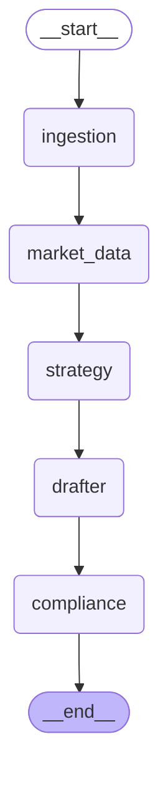

```mermaid
---
config:
  flowchart:
    curve: linear
---
graph TD;
	__start__([<p>__start__</p>]):::first
	ingestion(ingestion)
	market_data(market_data)
	strategy(strategy)
	drafter(drafter)
	compliance(compliance)
	__end__([<p>__end__</p>]):::last
	__start__ --> ingestion;
	drafter --> compliance;
	ingestion --> market_data;
	market_data --> strategy;
	strategy --> drafter;
	compliance --> __end__;
	classDef default fill:#f2f0ff,line-height:1.2
	classDef first fill-opacity:0
	classDef last fill:#bfb6fc

```